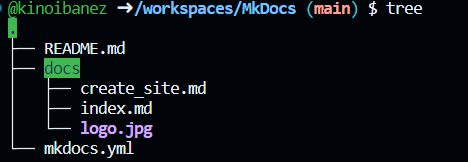
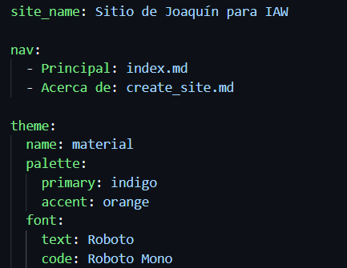

# Documento Create Site

- Este será el contenido del archivo de *_Create_site_* donde indicaremos como crear el principio de la página.

# MkDocs
Este repositorio es para realizar la página 6.2 de IAW donde trabajaremos con MkDocs.

## Primeros pasos que tendremos que hacer.

1. Como primer paso tendremos que hacer uso del siguiente comando : `docker run --rm -it -p 8000:8000 -v "$PWD":/docs squidfunk/mkdocs-material new .` Este comando realmente nos permitirá generar la estructura de un proyecto *_MK2_* desde cero.

2. Tendremos que crear un sitio llamado `about.md` dentro de la carpeta docs.

    

3. Tenemos que crear un archivo llamado *_mokdocs.yml_* para indicar la configuración que queremos añadir.

- Ejemplo del archivo: 

    

4. Si queremos generar un sitio web `servidor` desde nuestra consola, hacemos uso del siguiente comando `docker run --rm -it -p 8000:8000 -v "$PWD":/docs squidfunk/mkdocs-material`

